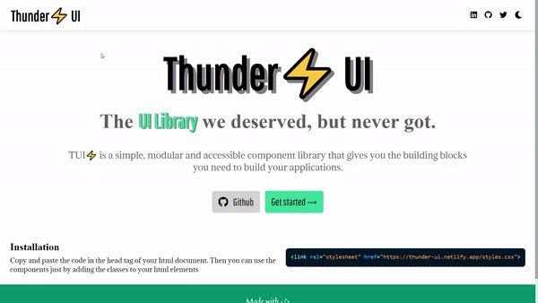

# THUNDER ⚡ UI

THUNDER UI allows you to create and design websites and webapps much faster by allowing you to use reusable components.

## Installation

To get started with ⚡ UI, copy the below link tag into the head of your HTML head and start using the built-in components by adding various classes by referring to the documentation site.

```
<link rel="stylesheet" href="https://thunder-ui.netlify.app/thunder.css">
```

## Demo



## Documentation

Check out the [Documentation](https://thunder-ui.netlify.app) for all the components.

## References

1.SVG Icons :fontawesome

2.Demo images: Google Images
